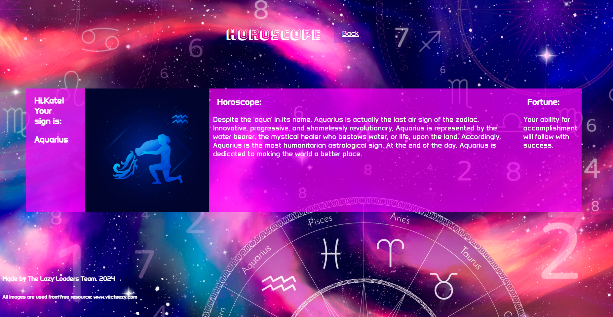

# Project-01-AstroWhisper
This is Ritu's, Anna's, and William's first project on an Astrology gnenerator

## Challenge 

The challenge is to develop a web application that offers horoscope for users based on their date of birth. Users can also find out their fortune for the day. We created the application from scratch starting with the the basic conecptualization of what we wanted, to making a basic wireframe in Bulma, to coding the app. 

## Solution

The final app integrates astrology insights based on user's zodiac sign (particularly, user's moon sign).

## User Story

```
AS An avid Astrology enthusiast
I WANT AN astrology generator
SO THAT I can obtain more information about Zodiac signs and recieve a fortune 
```

## Acceptance Criteria

```
GIVEN an astrology generator
WHEN I click the "Get strated!" button
WHEN I finish adding my name and birthday
THEN I click on submit
THEN I am taken to another page
WHERE I am presented with my Zodiac symbol with a brief description of sign and a fortune 
```

## Design 

1. Logoname & Background Image

Our logoname "Astro Whisper" and background image perfectly capture the essence of our astrological web application. The primary goal is to create a unique design for entertaining application conserning horoscope to attract users.

2. Screen of the web application

The screen of the first page of the web application contains the "Get started!" button. When user clicks the button, the modal pops up (user should insert name and date of birth).
The screen of the second page of the web application features a card with user's name, his/her zodiac (moon) sign, horoscope and fortune for the day. 

3. Styling done through custom CSS. Also, CSS variables are used for the background color, font-style and color of font.

4. Images

The background image and tweleve zodiac sign icons images were used from Zodiac Vectors by Vecteezy. Code for attribution: https://www.vecteezy.com/free-vector/zodiac" 

5. Responsive design

Fully responsive by using media queries.

## Screenshots 




## Deployed Link
https://itswillynilly.github.io/Project-01-AstroWhisper/

GitHub repo: https://github.com/ItsWillyNilly/Project-01-AstroWhisper

## Technology used

1. Third-parties APIs:

https://bulma.io/documentation/start/responsiveness/
https://day.js.org/

2. Server-Side API:

https://rapidapi.com/webchest.io/api/fortunecookie/
https://rapidapi.com/Tjosh/api/zodiac-sign-api1/

3. Resources:

https://www.vecteezy.com/free
https://fonts.google.com/


